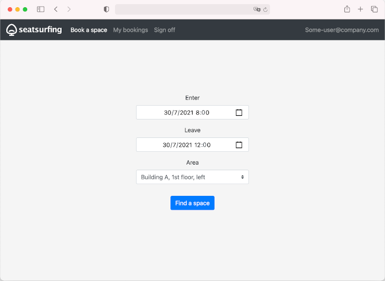

# Web App

Seatsurfing features a mobile-ready Web Booking Interface. The web app is a Progressive Web App (PWA), which means it can be "installed" on your mobile device's home screen and includes caching mechanisms. You can access the web booking UI using a modern web browser at:

- Cloud-hosted environments / SaaS: https://&lt;your-domain&gt;.seatsurfing.app/ui/
- Self-hosted environments: [http://localhost:8080/ui/](http://localhost:8080/ui/)

Your employees can use the web app to book their spaces independently and to manage their bookings, including the cancellation of their own existing bookings.

After logging in, the web booking UI should look like this:

From here, you can directly start to book a space.

Using the navigation bar at the top of the screen, you can view your upcomings bookings.

## Logging in

To log in, you need to know your Seatsurfing instance's URL and must have a user account. For both, ask your organization's Seatsurfing administrators.

Open the web app on your mobile device or computer. Afterwards, you can select one or more login methods.

If entering a password is required, you'll be asked to enter it.

Otherwise, you'll see one or more available authentication methods. Choose one of them. You'll be redirected to your organization's authentication service. Due to technical reasons, you may need to enter your email address a second time. After logging in, you'll be redirected back to the Seatsurfing ap. Depending on your connection, this might take a few seconds.

## Place a booking

To place a bookings, choose the desired period and area (i.e. floor).

You'll then see a floor plan showing the available (green) and unavailable (red) spaces. You can book a space by tapping it.

Your organization might have configured additional restrictions, such as:

- Max. booking duration
- Max. number of upcoming bookings per person
- Max. days a booking can be placed in advance

If such a restriction applies, an according message will be shown.

## Manage bookings

To manage your upcoming bookings tap "My bookings".

You'll see a list of your upcoming bookings in ascending order. To show details or to cancel a booking, tap it.

To keep things simple, it's not possible to modify an existing booking. Instead, you'll have to cancel and place a new booking.

## Preferences

### Calendar Integration

You can link your calendar to your Seatsurfing account, which means your bookings will appear in your calendar. This way, you can easily find out which desk to head for when approaching the office.

Currently, Seatsurfing supports CalDAV-enabled calendars with a default HTTP authentication. CalDAV is the standard for accessing and managing calendar data.

To connect your CalDAV-enabled calendar, please follow these steps:

1. Go to "Preferences" and select "Integrations".
1. Under "CalDAV calendar", enter the corresponding CalDAV URL of the server hosting your calendar (please ask your administrator if unclear), and enter the credentials.
1. Click "Connect" to retrieve the existing calendars.
1. Choose the calendar you want your bookings to appear in and click "Save".

Seatsurfing has implemented a one-way-sync at the moment. This means, your desk reservations will be created, updated and removed from your calendar, but any changes you perform directly in your calendar are not being reflected within Seatsurfing.

**Nextcloud**

You find the required settings as follows:

- CalDAV URL: In your Nextcloud calendar, click "Settings" and then "Copy primary CalDAV address".
- Username / password: Go to your "Personal settings", then create a new app password.

**Google Calendar**

Google Calendar is currently not supported as the CalDAV support relies on Google's Sign Sign On process.

**Microsoft Exchange (Outlook)**

Microsoft Exchange (Outlook) is currently not supported as CalDAV is not supported at all.

## Add to home screen

As a Progressive Web App (PWA), your users can "install" the booking web app. This means, they can add a shortcut to their home screen so they can subsequently access it with a single tap.

The process to install the Seatsurfing PWA differs between browsers. [The MDM web docs](https://developer.mozilla.org/en-US/docs/Web/Progressive_web_apps/Installing#the_install_user_experience) provide a good overview on how to install a PWA in various browsers and operating systems.
