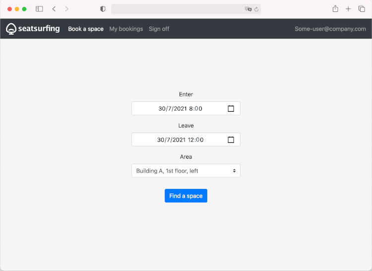

# Booking UI

Seatsurfing features a mobile-ready Web Booking Interface. The web app is a Progressive Web App (PWA), which means it can be "installed" on your mobile device's home screen and includes caching mechanisms. You can access the web booking UI using a modern web browser at:

- Cloud-hosted environments / SaaS: https://&lt;your-domain&gt;.seatsurfing.app/ui/
- Self-hosted environments: [http://localhost:8080/ui/](http://localhost:8080/ui/)

Your employees can use the web app to book their spaces independently and to manage their bookings, including the cancellation of their own existing bookings.

After logging in, the web booking UI should look like this:

From here, you can directly start to book a space.

Using the navigation bar at the top of the screen, you can view your upcomings bookings.

## Logging in

To log in, you need to know your Seatsurfing instance's URL and must have a user account. For both, ask your organization's Seatsurfing administrators.

Open the web app on your mobile device or computer. Afterwards, you can select one or more login methods.

If entering a password is required, you'll be asked to enter it.

Otherwise, you'll see one or more available authentication methods. Choose one of them. You'll be redirected to your organization's authentication service. Due to technical reasons, you may need to enter your email address a second time. After logging in, you'll be redirected back to the Seatsurfing app. Depending on your connection, this might take a few seconds.

### Multi-factor Authentication (MFA)

If your account has MFA configured, you will be prompted for a second factor after entering your password:

- **Passkey:** If you have a Passkey registered, your browser will automatically prompt you to verify using it (e.g. Touch ID, Face ID, or a hardware security key).
- **TOTP:** If you have TOTP configured but no Passkey, you will be asked to enter the 6-digit code from your authenticator app. If you have both configured, TOTP serves as a fallback if the Passkey prompt is dismissed or fails.

### Passwordless Login

If you have a Passkey registered, you can also log in without entering a password at all. Click **Sign in with Passkey** on the login page and follow your browser's prompt to select and verify your Passkey.

## Place a booking

To place a bookings, choose the desired period and area (i.e. floor).

You'll then see a floor plan showing the available (green) and unavailable (red) spaces. You can book a space by tapping it.

Your organization might have configured additional restrictions, such as:

- Max. booking duration
- Max. number of upcoming bookings per person
- Max. days a booking can be placed in advance

If such a restriction applies, an according message will be shown.

## Manage bookings

To manage your upcoming bookings tap "My bookings".

You'll see a list of your upcoming bookings in ascending order. To show details or to cancel a booking, tap it.

To keep things simple, it's not possible to modify an existing booking. Instead, you'll have to cancel and place a new booking.

## Preferences

### Security

In the **Security** section of Preferences, you can configure Multi-factor authentication (MFA) for your account. MFA adds an additional layer of protection beyond your password. Two MFA methods are supported: TOTP (authenticator app) and Passkeys. You can set up both simultaneously; Passkeys take priority, with TOTP as a fallback if a Passkey assertion fails.

MFA settings are not available for accounts that log in exclusively via an external Identity Provider (IdP/OAuth2).

#### TOTP (Authenticator App)

TOTP (Time-based One-Time Password) generates a 6-digit code that changes every 30 seconds in a compatible authenticator app such as Google Authenticator, Microsoft Authenticator, or Aegis.

To enable TOTP:

1. Go to **Preferences** and select **Security**.
1. Click **Enable TOTP**.
1. A QR code is shown. Scan it with your authenticator app. If preferred, click **Show secret** to view and copy the raw key manually.
1. Enter the 6-digit code shown in your authenticator app and confirm.

Once enabled, you will be asked for a TOTP code on every login after entering your password.

To disable TOTP, click **Disable TOTP** in the Security preferences. Note: if your organization has MFA enforcement enabled, you cannot disable TOTP while it is your only active second factor.

#### Passkeys

Passkeys are a modern, phishing-resistant authentication method based on the WebAuthn/FIDO2 standard. A Passkey can be a platform authenticator (e.g. Face ID, Touch ID, Windows Hello) or a hardware security key (e.g. YubiKey).

Passkeys can be used in two ways:

- **As a second factor:** After entering your email and password, you are prompted to verify using a registered Passkey.
- **Passwordless login:** On the login page, click **Sign in with Passkey** to authenticate without entering a password at all.

To register a Passkey:

1. Go to **Preferences** and select **Security**.
1. Click **Add Passkey**. If your browser or device does not support Passkeys, this button will be disabled.
1. Enter a name for the Passkey (e.g. "MacBook Touch ID" or "YubiKey").
1. Follow your browser's prompt to complete registration using your authenticator.

You can register up to 10 Passkeys per account. The list shows each Passkey's name, when it was created, and when it was last used.

To rename a Passkey, click **Rename** next to the desired entry. To remove a Passkey, click **Delete** and confirm. Note: if your organization has MFA enforcement enabled, you cannot delete your last Passkey if you also have no TOTP configured.

### Calendar Integration

You can link your calendar to your Seatsurfing account, which means your bookings will appear in your calendar. This way, you can easily find out which desk to head for when approaching the office.

Currently, Seatsurfing supports CalDAV-enabled calendars with a default HTTP authentication. CalDAV is the standard for accessing and managing calendar data.

To connect your CalDAV-enabled calendar, please follow these steps:

1. Go to "Preferences" and select "Integrations".
1. Under "CalDAV calendar", enter the corresponding CalDAV URL of the server hosting your calendar (please ask your administrator if unclear), and enter the credentials.
1. Click "Connect" to retrieve the existing calendars.
1. Choose the calendar you want your bookings to appear in and click "Save".

Seatsurfing has implemented a one-way-sync at the moment. This means, your desk reservations will be created, updated and removed from your calendar, but any changes you perform directly in your calendar are not being reflected within Seatsurfing.

**Nextcloud**

You find the required settings as follows:

- CalDAV URL: In your Nextcloud calendar, click "Settings" and then "Copy primary CalDAV address".
- Username / password: Go to your "Personal settings", then create a new app password.

**Google Calendar**

Google Calendar is currently not supported as the CalDAV support relies on Google's Sign Sign On process.

**Microsoft Exchange (Outlook)**

Microsoft Exchange (Outlook) is currently not supported as CalDAV is not supported at all.

## Add to home screen

As a Progressive Web App (PWA), your users can "install" the booking web app. This means, they can add a shortcut to their home screen so they can subsequently access it with a single tap.

The process to install the Seatsurfing PWA differs between browsers. [The MDM web docs](https://developer.mozilla.org/en-US/docs/Web/Progressive_web_apps/Installing#the_install_user_experience) provide a good overview on how to install a PWA in various browsers and operating systems.
